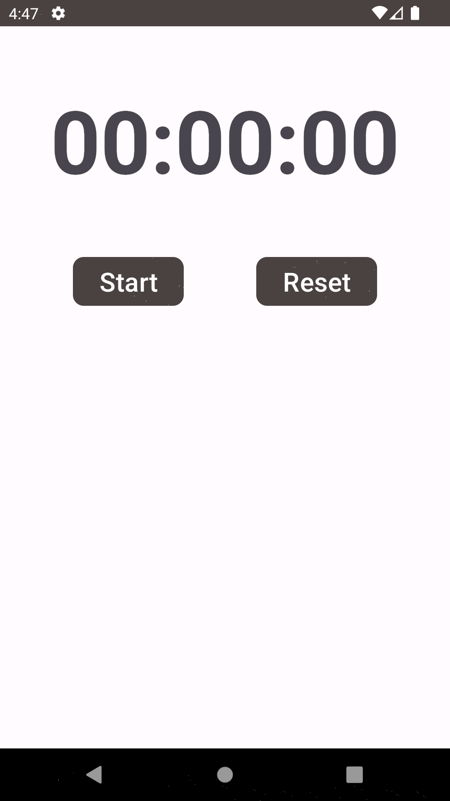
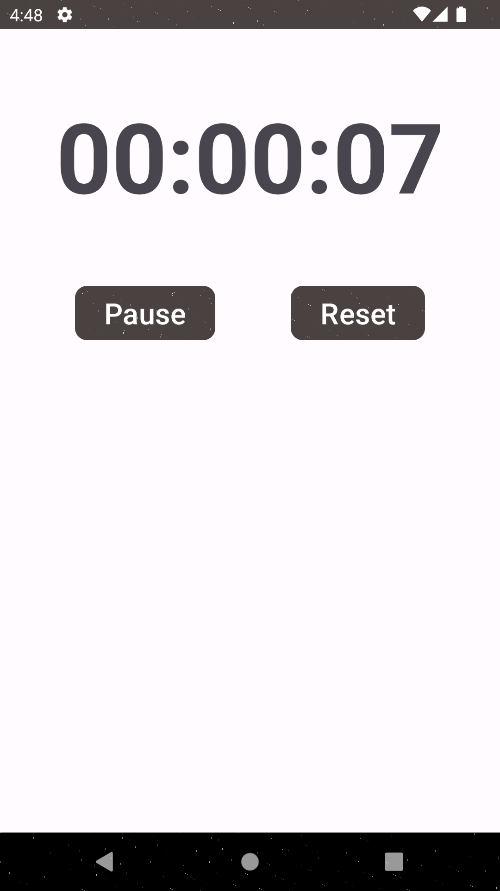

# Stopwatch

App de cronômetro.

Autor: Guilherme Reis - [LinkedIn](https://www.linkedin.com/in/guilhermereisdev/)

### Recursos do app

- Executa a contagem de segundos mesmo com o app em segundo plano.

### Técnicas utilizadas

- Service para permitir que o cronômetro continue contando os segundos mesmo com o app em segundo plano.
- BroadcastReceiver para receber os dados (segundos) do Service e atualizar a tela.

### Telas

_Clique na imagem para ver em tela cheia_

 
